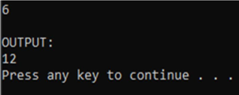

Users are required to enter a non-negative 
integer variables n using the keybroad (STDIN).
The system displays the sum of the last three even 
numbers in range from 0 to n.
Below is an example of how the program will run:
Enter the value 6 for 'n'



```cpp
#include <stdio.h>
#include <stdlib.h>
#include <string.h>
#include <math.h>


int main() {
  system("cls");
  //INPUT - @STUDENT:ADD YOUR CODE FOR INPUT HERE:

  
  
  // Fixed Do not edit anything here.
  printf("\nOUTPUT:\n");
  //@STUDENT: WRITE YOUR OUTPUT HERE:

  
  
  //--FIXED PART - DO NOT EDIT ANY THINGS HERE
  printf("\n");
  system ("pause");
  return(0);
}
```
