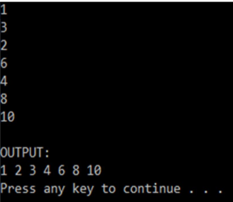

Your program allows users to enter 7 integer number into an array. The system performs selection sorting of array in ascending order then prints is a space character between any two adjacent number.
Below is an example of how the program will run:



```cpp
#include <stdio.h>
#include <stdlib.h>
#include <string.h>
#include <math.h>
int main() {
  system("cls");
  //INPUT - @STUDENT:ADD YOUR CODE FOR INPUT HERE:


  // Fixed Do not edit anything here.
  printf("\nOUTPUT:\n");
  //@STUDENT: WRITE YOUR OUTPUT HERE:


    }
  //--FIXED PART - DO NOT EDIT ANY THINGS HERE
  printf("\n");
  system ("pause");
  return(0);
}
```
