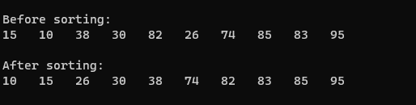

Ex2: Cho mảng được sinh ra bởi hàm createData(int a[], int n). Hãy thực hiện sắp xếp theo phương pháp Bubble và in ra màn hình.


Output when input N = -2:



<!--Output when input N = 10:-->

<!---->

Code:
```cpp

#include <stdio.h>
#include <stdlib.h>
#include <time.h>
// Create n numbers in the interval [10,100] randomly
void createData(int a[], int n)
  { srand(time(NULL));
    for(int i = 0; i<n; i++)
          a[i] = 10 + rand()%91; 
  }
void view(int a[], int n)
  { 
  }
void sort_bubbleSort(int a[], int n)
  { 
  }

int main()
  { system("cls");
	
    int a[100], n = 10;
    createData(a,n);
	
	//INPUT - @STUDENT:ADD YOUR CODE FOR INPUT HERE:
    printf("\nBefore sorting:\n");
    view(a,n);
    printf("\nAfter sorting:\n");
    sort_bubbleSort(a,n);
    view(a,n);
    printf("\n");
	
    //--FIXED PART - DO NOT EDIT ANY THINGS HERE
  printf("\n");
  system ("pause");
  return(0);
  }
  

```


