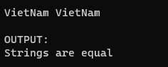

Output:



Code:
```cpp
#include <stdio.h>
#include <string.h>

int main() {
  system("cls");
  //INPUT - @STUDENT:ADD YOUR CODE FOR INPUT HERE:


   // Fixed Do not edit anything here.
  printf("\nOUTPUT:\n");
  //@STUDENT: WRITE YOUR OUTPUT HERE:


  //--FIXED PART - DO NOT EDIT ANY THINGS HERE
  printf("\n");
  system ("pause");
  return(0);
}
```

<!--```cpp-->
<!--#include <stdio.h>-->
<!--#include <string.h>-->

<!--#define MAX_LENGTH 100-->

<!--int main() {-->
<!--    char string1[MAX_LENGTH];-->
<!--    char string2[MAX_LENGTH];-->

<!--    printf("Enter the first string: ");-->
<!--    scanf("%s", string1);-->

<!--    printf("Enter the second string: ");-->
<!--    scanf("%s", string2);-->

<!--    int result = strcmp(string1, string2);-->

<!--    if (result == 0) {-->
<!--        printf("Strings are equal\n");-->
<!--    } else {-->
<!--        printf("Strings are not equal\n");-->
<!--    }-->

<!--    return 0;-->
<!--}-->
<!--```-->
