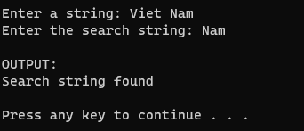

Write a program that reads a string input from the user using gets and another string to search for using scanf. Use strstr to find the first occurrence of the search string within the input string. Print "Search string found" if it is found and "Search string not found" otherwise.

output:




Code:
```cpp
#include <stdio.h>
#include <string.h>

int main() {
  system("cls");
  //INPUT - @STUDENT:ADD YOUR CODE FOR INPUT HERE:


   // Fixed Do not edit anything here.
  printf("\nOUTPUT:\n");
  //@STUDENT: WRITE YOUR OUTPUT HERE:


  //--FIXED PART - DO NOT EDIT ANY THINGS HERE
  printf("\n");
  system ("pause");
  return(0);
}
```

