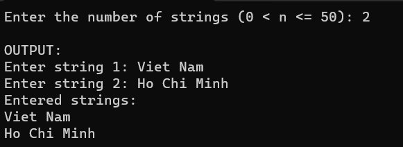

Write functions to perform following tasks:
1. Input integer n (0 < n <=50) and n string from the keyboard.
2. Display each string in a new line
3. Write main function

Output:



code:
```cpp

#include <stdio.h>
int main() {
  system("cls");
  //INPUT - @STUDENT:ADD YOUR CODE FOR INPUT HERE:
  // Fixed Do not edit anything here.
    int n;
    char input[50][100]; 
	
	printf("Enter the number of strings (0 < n <= 50): ");
	scanf("%d", &n);
    if ( n!= 1 || n <= 0 || n > 50) {
        printf("Invalid input. n should be between 1 and 50.\n");
        return 1; 
    }
    
	int c;
    while ((c = getchar()) != '\n' && c != EOF);
    
    inputStrings(n, input);
    displayString(n, input);
    
    // Fixed Do not edit anything here.
    printf("\nOUTPUT:\n");
    //@STUDENT: WRITE YOUR OUTPUT HERE:
      
    
    //--FIXED PART - DO NOT EDIT ANY THINGS HERE
    printf("\n");
    system ("pause");
    return(0);
}
```

