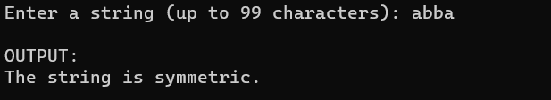

Write functions to perform following tasks:
1. Input a string from the keyboard.
2. Check a string is symmetric or not.
3. Write main function

Output:



code:
```cpp
#include <stdio.h>
int main() {
  system("cls");
  //INPUT - @STUDENT:ADD YOUR CODE FOR INPUT HERE:


    // Fixed Do not edit anything here.
    printf("\nOUTPUT:\n");
    //@STUDENT: WRITE YOUR OUTPUT HERE:
      
    
    //--FIXED PART - DO NOT EDIT ANY THINGS HERE
    printf("\n");
    system ("pause");
    return(0);
}
```