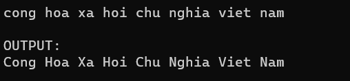

Write functions to perform following tasks:
1. Input number of string n (n>0 and n<=20) and n string from the keyboard.
2. Display all string you have entered to the screen
3. Enter a character from the keyboard and then Display to the screen all string contain character you have entered

Output:



Code:

```cpp
#include <stdio.h>
#include <ctype.h>

int main() {
	system("cls");
  	//INPUT - @STUDENT:ADD YOUR CODE FOR INPUT HERE:
  	
    char sentence[1000];
    int i ;
//    printf("Enter a sentence: ");
    fgets(sentence, sizeof(sentence), stdin);
    
    for (i= 0; sentence[i] != '\0'; i++) {
        if (i == 0 || sentence[i - 1] == ' ') {
            sentence[i] = toupper(sentence[i]);
        } else {
            sentence[i] = tolower(sentence[i]);
        }
    }
    
    // Fixed Do not edit anything here.
    printf("\nOUTPUT:\n");
    //@STUDENT: WRITE YOUR OUTPUT HERE:
    
    printf("%s\n", sentence);
    
    //--FIXED PART - DO NOT EDIT ANY THINGS HERE
    printf("\n");
    system ("pause");
    return(0);
}
```
