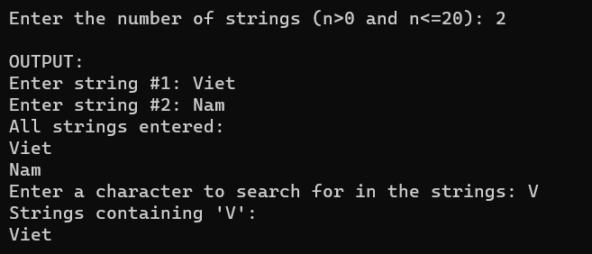

Write functions to perform following tasks:
1. Input number of string n (n>0 and n<=20) and n string from the keyboard.
2. Display all string you have entered to the screen
3. Enter a character from the keyboard and then Display to the screen all string contain character you have entered

Output:



```cpp
#include <stdio.h>
#include <string.h>

void inputStrings(int n, char strings[][100]) {

}

void searchCharacter(int n, char strings[][100], char character) {
   int i ;
    printf("Enter a character to search for in the strings: ");
    char searchChar;
    scanf(" %c", &searchChar);  

    printf("Strings containing '%c':\n", searchChar);
    for ( i = 0; i < n; i++) {
        if (strchr(strings[i], searchChar) != NULL) {
            printf("%s\n", strings[i]);
        }
    }
}


int main() {
	system("cls");
    // INPUT - @STUDENT: ADD YOUR CODE FOR INPUT HERE:
    


    // Fixed Do not edit anything here.
    printf("\nOUTPUT:\n");
    //@STUDENT: WRITE YOUR OUTPUT HERE:
    
    inputStrings(n, strings);
    
    displayStrings(n, strings);
    
    searchCharacter(n, strings, ch);
    } else {
        printf("Invalid input for the number of strings. Please enter a value between 1 and 20.\n");
    }

    //--FIXED PART - DO NOT EDIT ANY THINGS HERE
    printf("\n");
    system ("pause");
    return(0);
}
```

